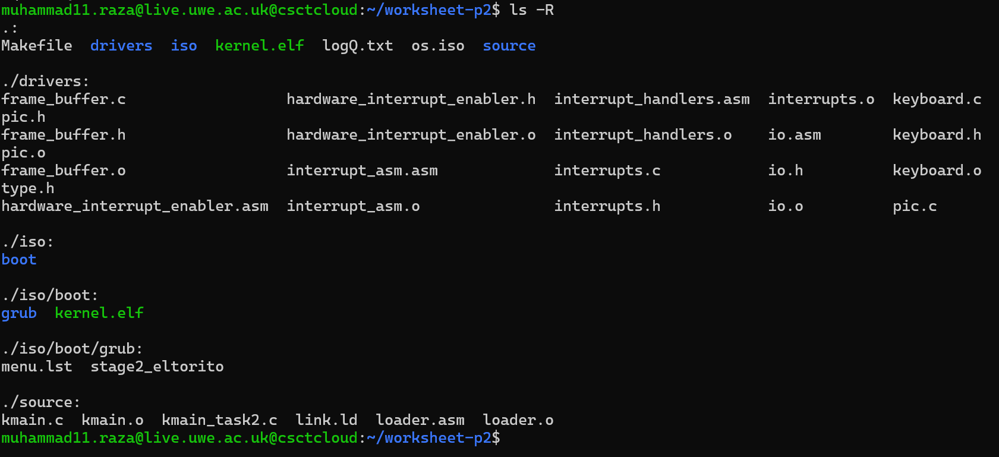
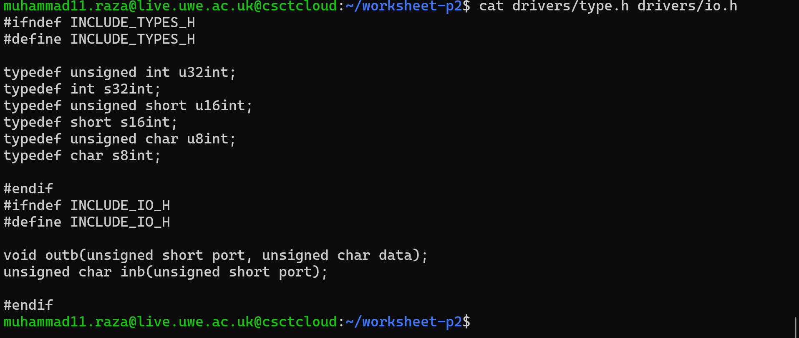
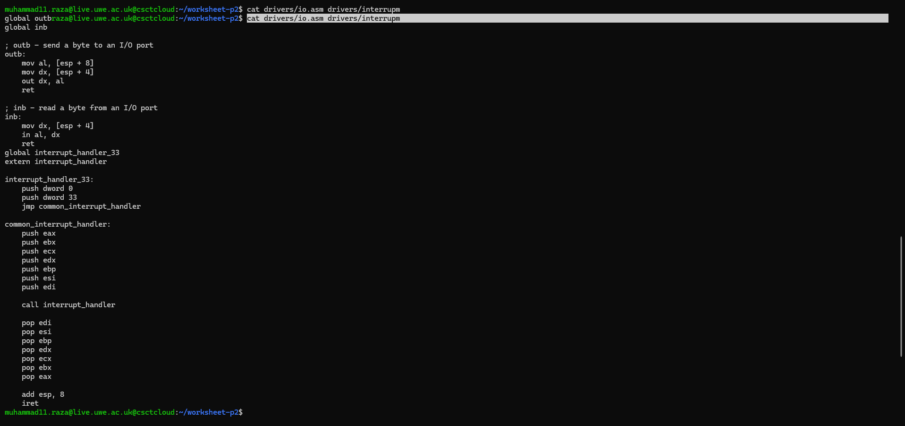
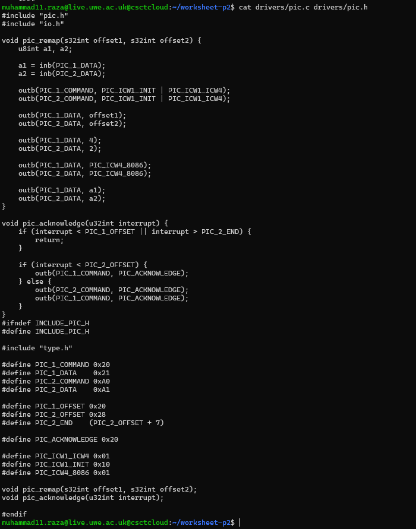
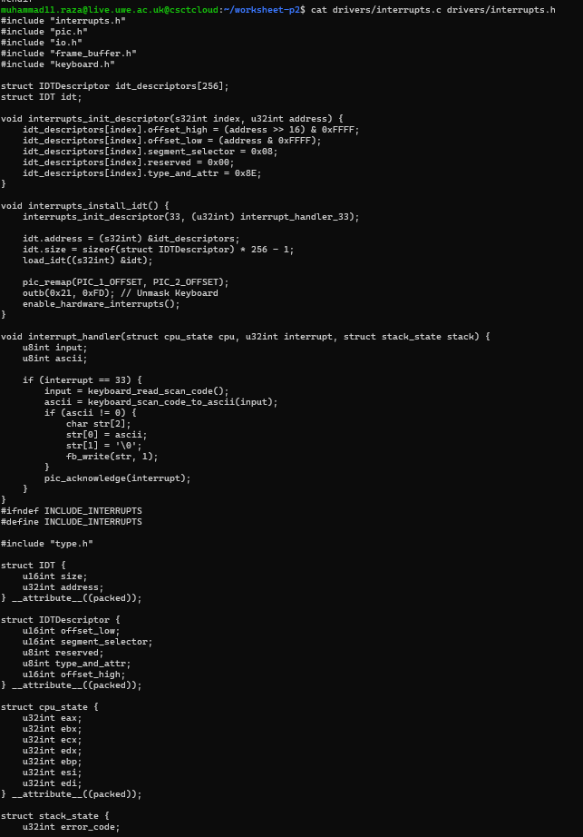
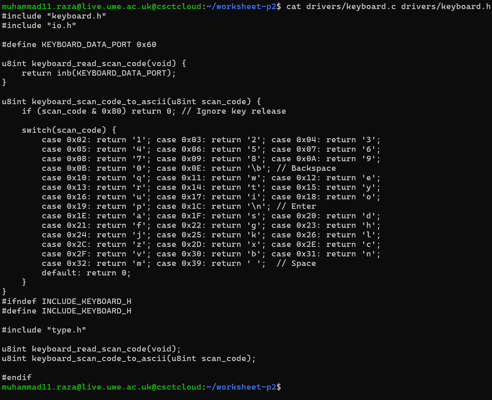
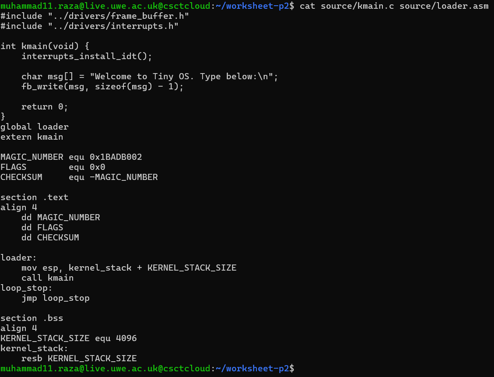
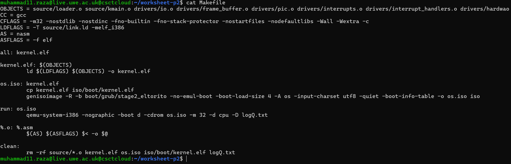
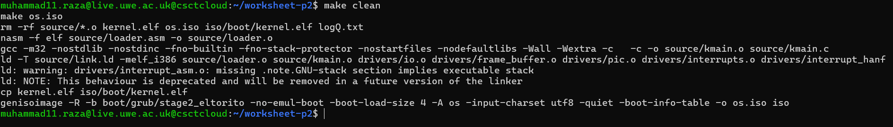
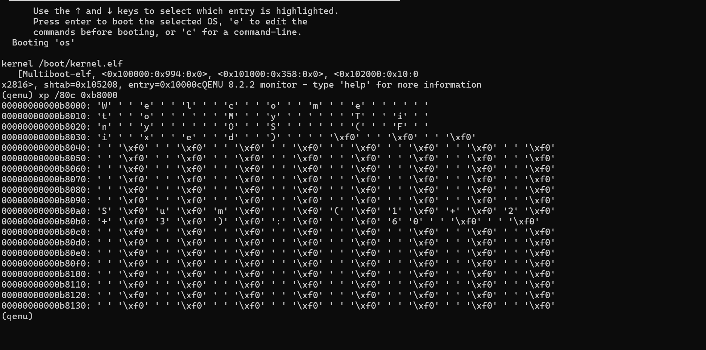

# Worksheet 2 Part 2: Interrupts and Keyboard Input

This repository contains the complete implementation for the second part of Worksheet 2. Building upon the minimal kernel from Part 1, this phase focuses on handling hardware interrupts, configuring the Programmable Interrupt Controller (PIC), and implementing a PS/2 Keyboard driver to process user input.

## Project Structure
I organized the project by separating the kernel logic (`source/`) from the hardware drivers (`drivers/`). This structure ensures modularity and makes the codebase easier to maintain.

**Directory Structure Screenshot:**


---

## Implementation Details

### 1. Basic Setup (Types & I/O)
To interact with hardware, I first defined standard data types (like `u8int`, `u32int`) to ensure consistent memory usage. I also implemented the `inb` (input byte) and `outb` (output byte) functions in assembly to communicate with hardware ports.

**Header Files:**


**Assembly Drivers:**


---

### 2. Programmable Interrupt Controller (PIC)
The PIC is responsible for mapping hardware signals (IRQs) to CPU interrupts. I wrote a driver to remap the PIC offsets so that hardware interrupts don't conflict with CPU exceptions.

**PIC Driver Code:**


---

### 3. Interrupt Descriptor Table (IDT)
The IDT tells the CPU which function to call when an interrupt occurs. I set up the IDT entries and wrote an Interrupt Service Routine (ISR) specifically for the keyboard (IRQ 1 / Interrupt 33).

**Interrupt Setup Code:**


---

### 4. Keyboard Driver
This was the core logic of this worksheet. I implemented a driver that reads "Scan Codes" from the keyboard data port (`0x60`) and converts them into ASCII characters using a lookup logic (Switch case).

**Keyboard Logic:**


---

### 5. Kernel Integration (Logic & API)
I updated the main kernel entry point (`kmain.c`) to meet all specific requirements and initialize interrupts:

- **Math Logic:** Implemented `sum_of_three` (1+2+3 = 6) and `multiply_two` (10*5 = 50) to verify C linking.
- **Driver API:** Enhanced the framebuffer driver to support `fb_clear()`, `fb_write_dec()` (for printing numbers), and custom text colors.
- **Interrupts:** Finally, it initializes the IDT and enables hardware interrupts to accept user input.

**Kernel Entry Point:**


---

## Build & Execution

I updated the `Makefile` to compile all the new drivers (`keyboard.o`, `interrupts.o`, `pic.o`, etc.) and link them into the final ISO image.

**Makefile Configuration:**


### Building the OS
I used the `make` command to compile the assembly and C files, link them using the linker script, and generate the bootable ISO.

**Build Success Proof:**


### Running the OS (Final Proof)
Since the server runs QEMU in `-nographic` mode, I verified the execution by inspecting the Video Memory (`0xB8000`) using the QEMU Monitor.
The memory dump below confirms all tasks:
- **Math Logic:** Shows `Sum (1+2+3): 6` and `Product: 50`.
- **Driver API:** Shows correct text colors.
- **Interrupts:** Shows **"Type below:"** confirming the OS is ready for keyboard input.

**Execution Memory Dump:**


---

## How to Run
1. **Clone the repository.**
2. **Build and Run the project:**
   ```bash
   make clean
   make os.iso
   make run
   ```
   
